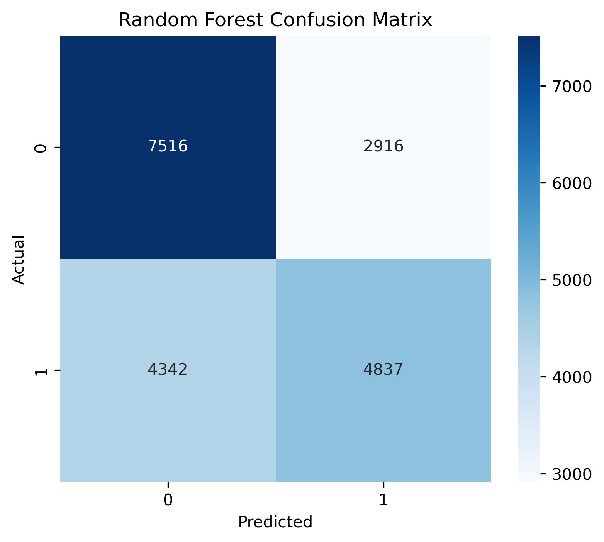
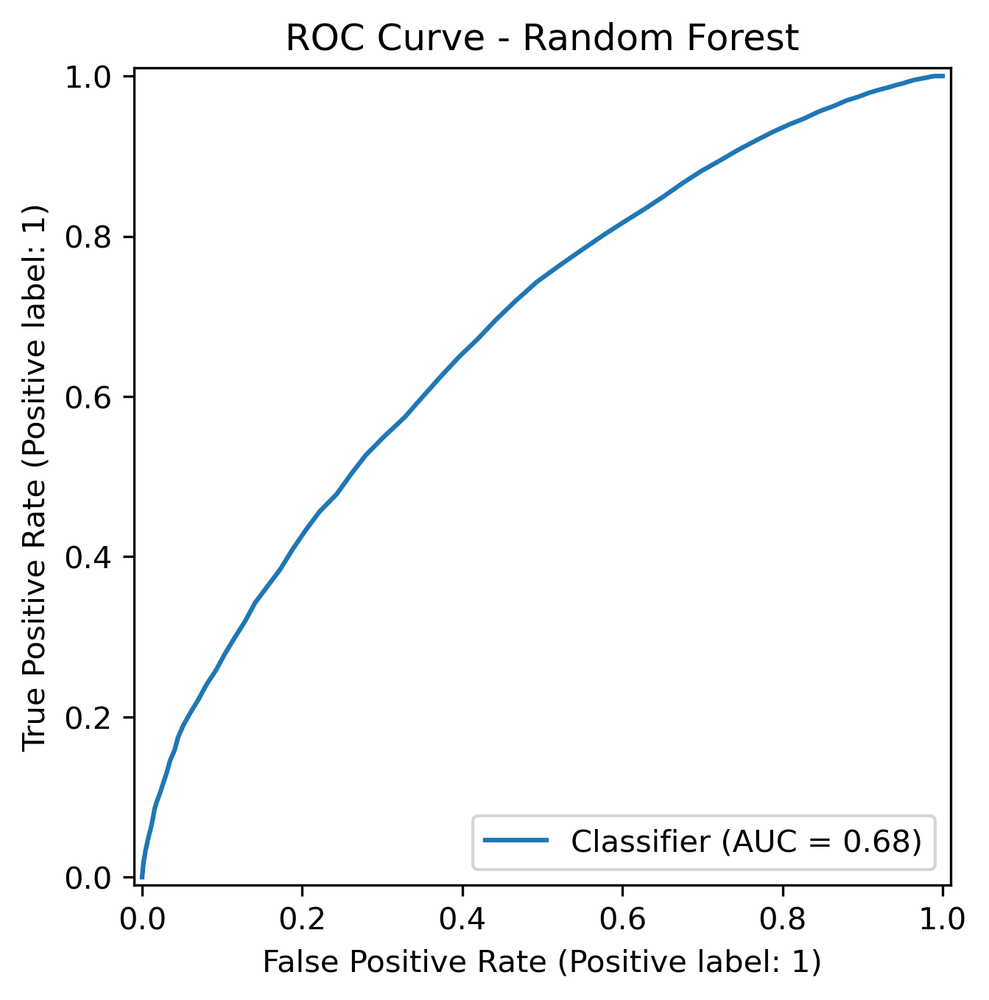
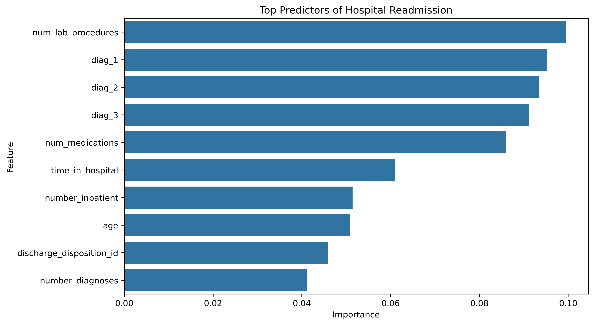

# Clinical Risk Prediction Using Machine Learning

## Overview

This project develops machine learning models to predict hospital readmission risk using clinical and demographic healthcare data. The analysis demonstrates an end-to-end predictive modelling workflow including data preprocessing, feature engineering, model training, evaluation, and interpretability analysis.

The project compares a baseline Logistic Regression model with a Random Forest classifier to evaluate predictive performance for clinical risk prediction tasks.

## Objectives

- Predict patient hospital readmission risk
- Compare statistical and ensemble machine learning methods
- Evaluate classification performance using multiple metrics
- Identify clinically important predictors associated with readmission
- Demonstrate reproducible healthcare machine learning workflows

## Dataset

The dataset contains patient-level hospital records including:

- Demographic variables
- Admission characteristics
- Diagnostic information
- Medication-related variables
- Laboratory and clinical indicators

The target variable represents whether a patient was readmitted to the hospital.

## Methods

### Data Preprocessing

The preprocessing workflow included:

- Missing value handling
- Removal of highly incomplete variables
- Encoding categorical features
- Feature selection
- Train-test split preparation

### Machine Learning Models

The following models were implemented:

1. Logistic Regression
2. Random Forest Classifier

### Model Evaluation

Models were evaluated using:

- Accuracy
- Precision
- Recall
- F1-score
- ROC-AUC score
- Confusion matrix analysis

### Explainability

Feature importance analysis was conducted using Random Forest importance scores to identify the strongest predictors associated with hospital readmission.

## Results

The Random Forest model achieved stronger predictive performance than the Logistic Regression baseline.

Key predictors included:

- Number of laboratory procedures
- Diagnostic categories
- Number of medications
- Time spent in hospital
- Prior inpatient visits
- Number of diagnoses

The analysis demonstrates how machine learning methods can support healthcare risk prediction while maintaining interpretability.

## Visualizations

The project includes:

- Confusion matrix visualization
- ROC curve analysis
- Feature importance plots

Example outputs are available in the `figures/` directory.

## Figures

### Confusion Matrix



### ROC Curve



### Feature Importance



## Repository Structure

```text
clinical_risk_prediction/
│
├── data/
├── notebooks/
├── figures/
├── README.md
└── requirements.txt
```

## Tools and Libraries

### Programming Language

- Python

### Main Libraries

- pandas
- numpy
- scikit-learn
- matplotlib
- seaborn
- xgboost

## Reproducibility

The project was developed using reproducible workflows with structured preprocessing, model evaluation, and version-controlled project organization through GitHub.

## Future Improvements

Potential extensions include:

- Hyperparameter optimization
- Cross-validation workflows
- Additional ensemble models
- Explainable AI methods (SHAP values)
- Deployment as a clinical decision-support application

## Author

**Mayuri Chatterjee**  
PhD Researcher in Statistics  
Stockholm University
